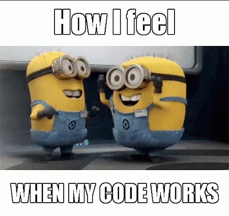

# Plus Resources: Weather Project Template

Starter code for the Plus Weather project.

## TODO

- [ ] Implement the methods in `weather.py`.
- [ ] Verify that everything works as intended by running the tests with `python run_tests.py`.

### Project Status

####  Summing up my thought process working on this project

